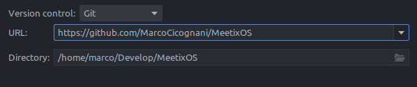
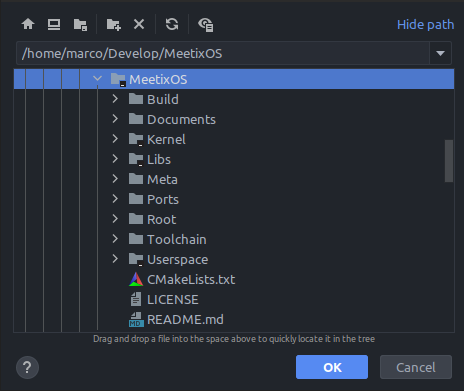
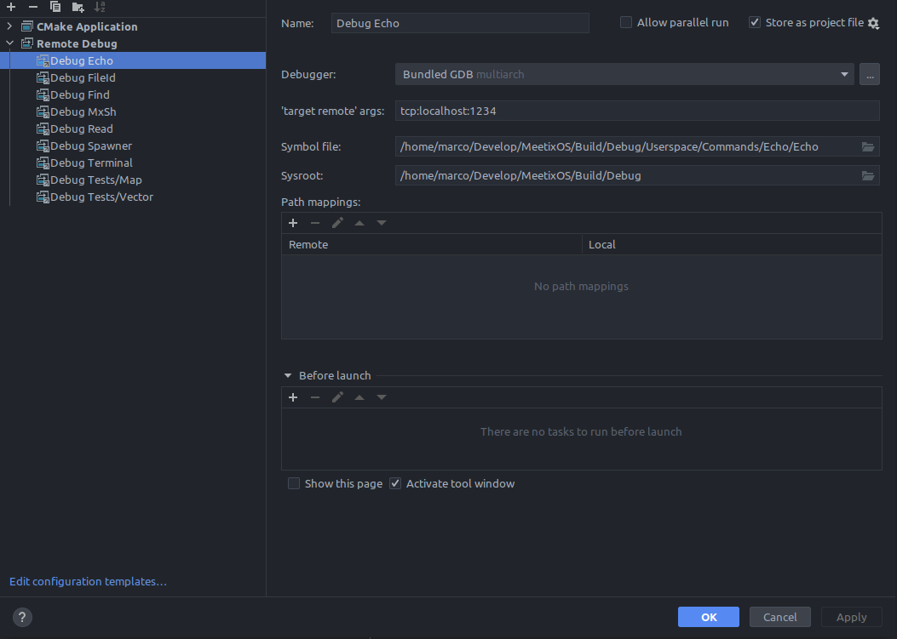
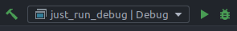
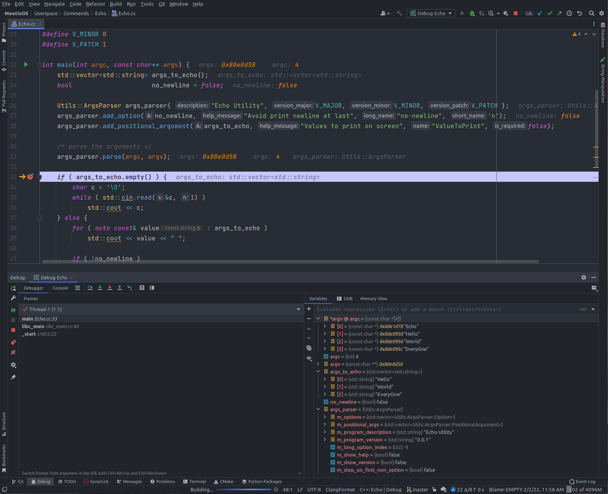
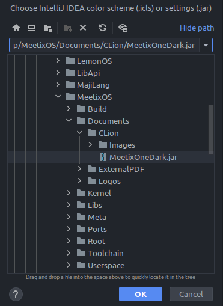

# MeetixOS Default IDE: CLion

I use the `Jetbrains CLion IDE` to develop MeetixOS, this is the main reason why I use `CMake` as build system.

## Download the Repository

Go to `File` > `New` > `Project from Version Control...` then paste the git URL

After downloaded the repository CLion will open and load the project

### Open the Repository

Go to `File` > `Open...` then select the MeetixOS repository, which could be marked as CLion project

# Note

- Expect `CMake` loading errors until the toolchain aren't built
- Project targets are shared with the repository, so, after the toolchain build, `CLion` should be able to already load
  and build the project without any error
- To execute the `run`/`repack` targets use the hammer icon, instead of the play icon

# Debugging

## Configuration

It's possible to use CLion's remote debugging to debug MeetixOS.

Go to `Edit Configurations...` and add a `Remote Debug` entry using `+`

- Give a `Name` which should be `Debug TargetToDebug`
- Leave Bundled GDB in `Debugger`
- Type `tcp:localhost:1234` in `'target remote' args`
- Type the absolute path to the executable to debug into `Symbol file`
- Type the absolute path to the build directory (including the build type `Debug`/`Release`) in `Sysroot`

## Run Debugging

- Select the `just_run_debug` target and run it with the hammer
    - Be sure to perform at least a `repack` target before `just_run_debug`

- Select the debug target you created and click the debug button

- MeetixOS starts (slowly without KVM) then you be able to set breakpoints along the code, check the runtime data,
  execute step by step and so on

# MeetixOS Theme

If you like `OneDark`-like themes I have the stuff right for you, the official `MeetixCLion` editor theme.

Go to `File` > `Settings...` > `Editor` > `Color Scheme` > Click the Gear > `Import Scheme...` then select
the `MeetixOS/Documents/CLion/MeetixOneDark.jar`

